## 开发问题解决：**前端组件与后端数据之间的“响应式绑定”或“数据映射”逻辑未打通**

针对你提到的“Demo已完成，但导入数据后卡片和表格不根据实际数据变化”的问题，这通常是因为**前端组件与后端数据之间的“响应式绑定”或“数据映射”逻辑未打通**。
这是新手开发数据可视化工具最容易遇到的坑。核心问题往往不在于数据库，而在于**Schema（元数据）的动态适配**。
以下是针对该问题的**技术架构修复方案**，重点在于“动态数据绑定”。

### 一、 问题诊断：为什么数据不变化？

你的问题可能属于以下两种情况之一：

1. **硬编码问题（最常见）：** 你的卡片组件写死是显示 `data.sales`，但你导入的数据列名是 `revenue`。前端找不到 `sales` 字段，所以显示为空或0。
2. **状态更新问题：** 导入是一个异步过程，导入完成后，前端没有主动触发“重新获取最新表结构”或“重新查询统计数据”的动作。

***

### 二、 架构优化方案：元数据驱动架构

要做一个通用的分析工具，架构上必须引&#x5165;**“元数据层”**。

#### 1. 整体数据流转架构图

我们需要将架构从“写死代码”转变为“配置驱动”：

```mermaid
graph TD
    A[用户导入CSV/Excel] --> B{后端解析服务};
    B --> C[(原始数据库)];
    B --> D[(元数据库/Schema)];
    
    D -- 1. 返回字段定义(name/type) --> E[前端字段映射配置页];
    E -- 2. 用户配置(指标/维度) --> F[保存配置JSON];
    
    F --> G[分析引擎];
    C --> G;
    
    G -- 3. 动态SQL查询 --> H[前端卡片/图表组件];
```



####


#### 2. 核心模块修复逻辑

你需要增加以下两个核心机制：

**机制 A：动态 Schema 嗅探**

* **后端逻辑：** 当数据导入时，后端不仅存数据，还要分析表头，并在 `dataset_configs` 表中记录下这次导入有哪些列、每列是什么类型（数字、文本、日期）。
* **前端逻辑：** 导入成功后，立马调用 `GET /api/datasets/{id}/schema` 接口，拿到真实的列名。

**机制 B：配置映射**

* 不要让卡片直接去读数据，而是让卡片读取“配置”。
* 用户需要在一个界面上指定：“这个卡片显示的是 B列的总和”或者“表格的第一列显示 A列”。保存这个配置后，卡片组件根据配置去请求数据。

***

### 三、 具体的落地实施步骤

#### 步骤 1：后端接口优化 —— 增加 Schema 反馈

你的导入接口不应只返回 "Success"，必须返回数据的元信息。

**Python (FastAPI) 伪代码示例：**

```python
@router.post("/upload")
async def upload_data(file: UploadFile):
    # 1. 解析文件
    df = pd.read_csv(file.file)
    
    # 2. 存入数据库 (这里简化为入库操作)
    # table_name = generate_table_name()
    # df.to_sql(table_name, engine)
    
    # 3. 【关键步骤】提取元数据
    columns_info = []
    for col in df.columns:
        columns_info.append({
            "name": col,
            "type": str(df[col].dtype), # 如 int64, object, datetime
            "sample_value": df[col].iloc[0] if len(df) > 0 else None
        })
    
    # 4. 返回给前端，告诉前端有什么数据
    return {
        "status": "success",
        "dataset_id": "xxx",
        "row_count": len(df),
        "columns": columns_info  # <--- 前端拿到这个才知道有什么字段
    }
```

#### 步骤 2：前端交互优化 —— 消除硬编码

前端组件必须变成“傻瓜式”组件，只接受 `config` 和 `data`。

**Vue3 组件设计思路：**

```javascript
// CardComponent.vue
// 错误写法（硬编码）：
// <div>{{ data.sales }}</div> 
// 正确写法（动态配置）：
<template>
  <div className="card">
    <div class="title">{{ config.title }}</div>
    <div className="value">{{ computedValue }}</div>
  </div>
</template>
<script setup>
import { computed } from 'vue';
const props = defineProps({
  config: Object, // 例如 { metric: 'sum_amount', label: '总金额' }
  data: Array     // 原始数据 [{date:..., amount:...}, ...]
});
// 根据配置动态计算数值
const computedValue = computed(() => {
  if (!props.data || !props.config) return '-';
  
  // 假设配置里指定了要算 'amount' 列的总和
  // 这里的逻辑要根据你的需求变复杂：求和、平均、计数等
  if (props.config.operation === 'sum') {
      return props.data.reduce((sum, row) => sum + Number(row[props.config.field] || 0), 0);
  }
  // ... 其他逻辑
  return 0;
});
</script>
```

#### 步骤 3：连接环节 —— 导入后的回调

在你的“导入按钮”逻辑里，必须加上以下流程：

```javascript
async function handleUploadSuccess(response) {
    // 1. 提示用户导入成功
    ElMessage.success(`导入成功，共 ${response.row_count} 条数据`);
    
    // 2. 【关键】更新前端的全局状态或触发查询
    // 将返回的 columns 保存到 store，让“配置页”或“图表页”知道有哪些列可用
    useDatasetStore().setCurrentSchema(response.columns, response.dataset_id);
    
    // 3. 如果已有配置，自动重新查询数据
    // 或者跳转到“配置分析维度”的页面，让用户把新导入的列拖到图表里
    await fetchAnalysisData(response.dataset_id);
}
```

***

### 四、 针对你当前情况的修复 Prompt

你可以把下面这段话发给你的 AI 编程助手，让它帮你重构现有的代码：

**提示词:**

> **背景：**&#x6211;正在开发一个数据分析工具 Demo。目前已经实现了后端数据导入和数据库存储，前端使用 Vue3 + ECharts。
>
> **遇到的问题：**&#x5F53;我导入一个新的 CSV 文件后，前端的“数据卡片”和“表格”组件没有显示新数据，依然显示旧数据或空白。
>
> **需求分析：**&#x6211;判断是因为前端组件写死了字段名，或者导入后没有触发数据重新渲染。我需要实现“动态数据绑定”。
>
> **请帮我修改代码，要求如下：**
>
> 1. **后端:** 请检查数据导入接口，确保返回值中包含**动态解析的表头信息**，而不是写死的字段。
> 2. **前端逻辑:**
>    * 请帮我设计一个全局状态管理，用来存储“当前数据集的字段列表”。
>    * 在文件上传成功的回调函数中，必须调用接口获取最新字段，并更新这个全局状态。
> 3. **组件改造:**
>    * 请帮我修改“卡片组件”和“表格组件”。
>    * 卡片组件不要直接写 `{{data.fieldName}}`，而是接收一个 `prop` 叫 `targetField`，动态去 `data` 里找对应的值。
>    * 表格组件的列定义，需要根据后端返回的 Schema 动态生成，而不是写死在 `<el-table-column>` 里。
>
> **请给出具体的代码修改示例，重点展示如何将硬编码改为动态配置。**

***

### 总结

你遇到的问题本质上&#x662F;**“模型与视图解耦”**&#x7684;问题。

* **现状：** 视图（卡片）绑定了固定的模型（写死的字段）。
* **目标：** 视图（卡片）通过配置层，动态适应新的模型（导入的字段）。

按照上述架构，增加一&#x4E2A;**“配置页”**（让用户指定哪一列是指标），或者在后端增&#x52A0;**“智能推测”**（自动把数字类型的列当作指标），你的工具就会真正“活”起来。
